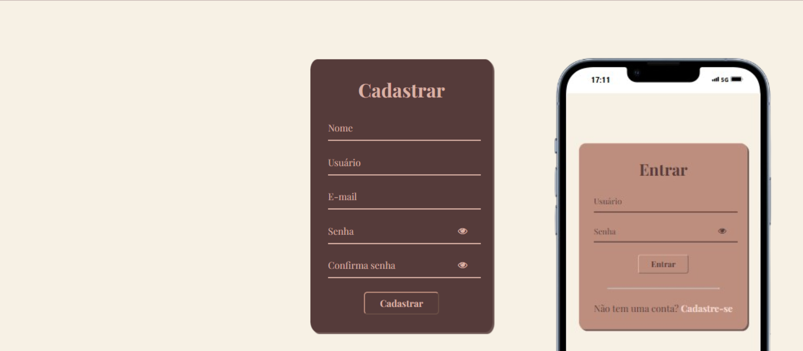

<h1 align="center"> Sistema de autentificação de usuário </h1>

Programa gratuito, criado como projeto de aprendizado e aplicação.  

  <a href="#-tecnologias">Tecnologias</a>&nbsp;&nbsp;&nbsp;|&nbsp;&nbsp;&nbsp;
  <a href="#-projeto">Projeto</a>

 

  

## 🚀 Tecnologias

Esse projeto foi desenvolvido com as seguintes tecnologias:

- HTML e CSS
- JavaScript
- Git e Github
- Local Storage

## 💻 Projeto

Este é sistema com tres telas dedicado ao login e cadastro de usuário com armazenamento local (Local Storage).

---

By Giovanna Camargo.
